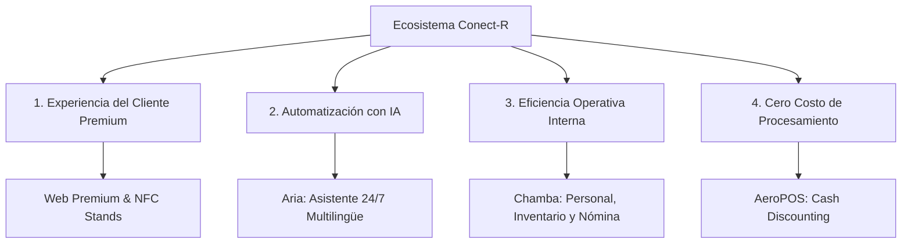

# Propuesta de Valor Estratégica: Ecosistema Conect-R

## 1. Definición de la Propuesta de Valor Central
**Conect-R** no es un proveedor de páginas web ni un software administrativo aislado; es el **sistema operativo estético e integral definitivo para restaurantes**. 

Nuestra propuesta de valor radica en la **unificación total**: consolidamos la presencia digital interactiva, la interacción inteligente con clientes (a través de inteligencia artificial), la gestión del personal e inventarios y el procesamiento transaccional en un solo ecosistema integrado de alta gama (Hardware + SaaS). 

Al eliminar la necesidad de contratar múltiples proveedores tecnológicos inconexos ("Frankenstein Tech Stack"), Conect-R reduce drásticamente los costos operativos, simplifica la gestión del restaurante y ofrece un impacto visual premium que atrae y fideliza comensales.

---

## 2. Los Cuatro Pilares del Ecosistema Conect-R

### 1. Experiencia del Cliente e Impacto Visual Premium (*Wow-Factor*)
*   **Websites Interactivos a Medida:** Diseñados desde cero sin plantillas prefabricadas (como WordPress o Wix). Utilizamos tendencias de diseño moderno como *glassmorphism*, micro-animaciones fluidas y tipografías optimizadas para generar confianza e incrementar reservas.
*   **Hardware NFC Elegante (NFC Stands):** Displays físicos premium colocados en las mesas. Con solo acercar su smartphone, los comensales acceden al menú digital de alta velocidad, permitiendo actualizaciones de precios en tiempo real sin costos de reimpresión.
*   **Menús Dinámicos (TV Menu Boards):** Sistema de pantallas en el local para promocionar platos especiales y dinamizar visualmente el área de barra o comida rápida.

### 2. Automatización Inteligente 24/7 (Aria AI Assistant)
*   **Aria:** Un agente virtual bilingüe (español/inglés) integrado directamente en el sitio web del restaurante.
*   **Valor Operativo:** Resuelve dudas de clientes en tiempo real, guía a los usuarios para hacer reservaciones y ayuda a levantar pedidos sin presiones de venta, operando las 24 horas del día.

### 3. Consolidación de Operación Interna (Plataforma Chamba)
*   **Gestión de Staff y Labor:** Control digital de turnos, horarios y rendimiento de los empleados.
*   **Control de Inventarios:** Seguimiento de insumos, costos de recetas y herramientas activas para reducir el desperdicio (mermas).
*   **Cálculo de Nómina (Payroll):** Monitoreo de horas trabajadas y dispersión automatizada de propinas.

### 4. Transacciones Inteligentes y Ahorro en Procesamiento (Conect-R POS / AeroPOS)
*   **Punto de Venta Moderno:** Competitivo con los sistemas líderes (como Toast POS) pero con una interfaz de usuario significativamente más limpia y ágil.
*   **Cash Discounting (Eliminación de Comisiones):** Lógica integrada para trasladar el costo del procesamiento transaccional (3.99%) al comensal que paga con tarjeta, permitiendo al restaurante **reducir a 0% su factura de comisiones por transacciones de tarjetas**.

---

## 3. Comparativa: Conect-R vs. Soluciones Tradicionales Fragmentadas

| Área Operativa | Solución Tradicional Fragmentada | Solución Unificada Conect-R |
| :--- | :--- | :--- |
| **Sitio Web** | WordPress / Wix genérico e inestable ($50 USD/mes) | Website Premium interactivo, veloz y a la medida (Incluido) |
| **Reservas** | OpenTable / Resy ($200 - $300 USD/mes + cobro por comensal) | **Table Reserve** integrado, sin fricciones ni cargos extras (Incluido) |
| **Espera de Mesas** | Lista de espera manual o software adicional ($100 USD/mes) | **NextUp Waitlist** con notificaciones SMS al móvil (Incluido) |
| **Back-Office** | Hojas de cálculo o sistemas de personal adicionales ($150 USD/mes) | **Chamba** (Staff + Inventario + Nómina integrados) (Incluido) |
| **Menús** | Reimpresión constante de menús físicos de papel | **NFC Stands** elegantes y **TV Boards** dinámicos (Incluido) |
| **Procesamiento POS** | Pago de 2.5% a 3.5% sobre todas las ventas del restaurante | **AeroPOS** con opción de **Cash Discounting** (0% costo neto) |
| **Soporte** | Call-centers lentos y respuestas automatizadas | Soporte directo y cercano de "Guante Blanco" con base local |

---

## 4. Estructura de Inversión y Beneficio del Bundle

El modelo híbrido de Conect-R ofrece flexibilidad absoluta para adquirir módulos de forma individual o adoptar el ecosistema completo bajo condiciones preferenciales.

### Tabla de Inversión "A la Carta" vs. "Bundle Ecosistema"

| Módulo / Servicio | Setup Inicial (A la Carta) | Renta Mensual (A la Carta) | Ecosistema Completo (Bundle) |
| :--- | :--- | :--- | :--- |
| **Website Premium + Aria AI** | $1,000 USD | $250 USD | Incluido |
| **Table Reserve** | $150 USD | $200 USD | Incluido |
| **NextUp Waitlist** | $150 USD | $100 USD | Incluido |
| **Chamba (Back-office)** | $300 USD | $200 USD | Incluido |
| **NFC Stands (50 uds.)** | $750 USD | $100 USD | Incluido |
| **TV Menu Boards (x3)** | $300 USD | $150 USD | Incluido |
| **Total Acumulado** | **$2,650 USD** | **$1,000 USD** | **Setup: $1,800 USD** **Mensual: $750 - $800 USD** *(25% Descuento)* |
| **Ahorro Garantizado** | - | - | **$850 USD en el arranque inicial** **$200 - $250 USD/mes durante 6 meses** |

> [!TIP]
> **Modelo Plug & Play:** Al no depender obligatoriamente de una compleja instalación física de POS en sitio, los módulos digitales de Conect-R se implementan remotamente en cualquier restaurante de Estados Unidos en pocas horas, permitiendo escalar el negocio desde Sacramento hacia todo el país.

---

## 5. El Retorno de Inversión (ROI) y Valor Estratégico

1.  **Atracción y Conversión Instantánea:** Un sitio web de alta gama y la atención inmediata de **Aria** capturan el tráfico nocturno y de fin de semana, convirtiendo más visitantes casuales en reservaciones efectivas.
2.  **Reducción de Aglomeraciones:** **NextUp** y la visualización de menús interactivos disminuyen los cuellos de botella en la entrada, incrementando la rotación de mesas hasta en un 15%.
3.  **Control de Márgenes (Chamba):** La optimización de turnos y la reducción activa de desperdicios de inventario mejoran el margen neto de alimentos y bebidas del restaurante.
4.  **Autonomía y Enfoque:** Al integrar los sistemas técnicos de forma estable y bajo el soporte de nuestro equipo (Edgardo, Armando y Ricardo), los restauranteros se dedican al 100% a la hospitalidad, liberándose de la gestión y mantenimiento de software.
